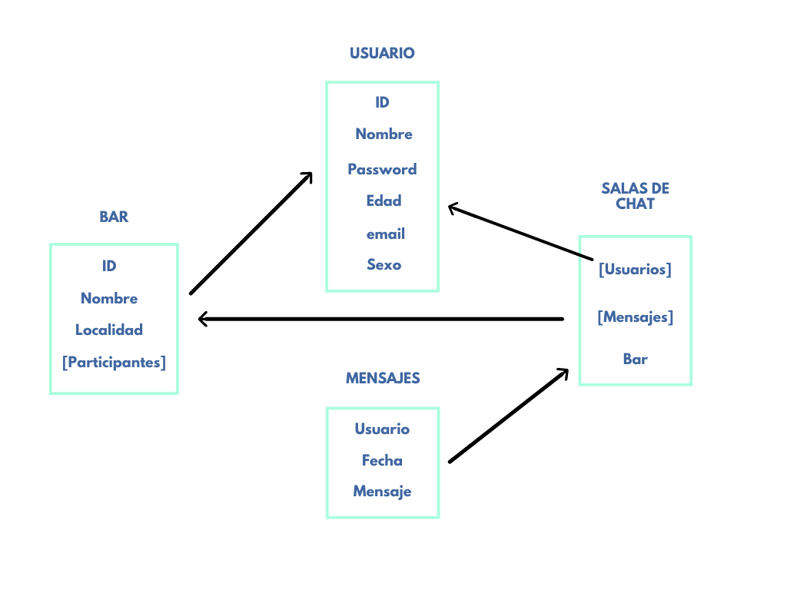

# ChatBar

## Contexto de la app

Con esta single-page app podrás chatear con personas que se encuentren dentro de un mismo bar.
En una época marcada por la pandemia causada por el virus SARS-CoV-2, comúnmente conocido como "covid-19", tras varios meses de confinamientos y restricciones en todo el mundo, cada país poco a poco se dirige a la normalidad previa a esta enfermedad.

En el caso de España, en el sector de la restauración y el ocio nocturno, se deben respetar una serie de restricciones que hacen que nuestra manera de relacionarnos con la gente haya cambiado.
Una de las medidas acordadas por las autoridades sanitarias es la del distanciamiento social, que obliga a las personas asistentes a cualquier bar o pub a ocupar una mesa determinada no pudiendo moverse entre éstas y no pudiendo ser más de cuatro personas en cada una.

La idea de esta app surge a raíz de lo anteriormente expuesto, posibilitando así el hecho de relacionarnos con gente de una manera mixta; de manera presencial pero a la vez respetando las medidas sanitarias.

## ¿Qué puede hacerse?

- Crear usuario
- Login
- Ver lista de bares
- Entrar/salir de un bar
- Ver los usuarios del bar
- Ver perfiles
- Crear sala de chat
- Enviar mensaje
- Eliminar chat
- Ver mis chats

## Backend

Basado en Node.JS.
Base de datos alojada en MongoAtlas. Llamadas a la BD y modelo de datos a través de Mongoose.
Encriptamiento de datos (password) y protección de rutas privadas con bcrypt y jsonwebtoken.
Direccionamiento con Express.

### Diagrama de relaciones entre modelos

### Direccionamiento

Usuario 
> /users

    GET:        /                       → encuentra todos los users
    POST:       /signup                 → creación de nueva cuenta
                /login                  → ingresar en la app
                
Bares
> /bares

    GET:        /                       → muestra lista de bares con las keys: id, name, city, y cantidad cantidad de users
    POST:       /                       → crear un nuevo bar
    GET:        /find/:id               → buscar bar por su id
    PUT:        /add_user               → añadir usuario a un bar
                /remove_user            → eliminar usuario de un bar
    DELETE:     /remove_bar             → eliminar bar

Chat room

> /chat_room

    GET:        /find/:id               → encontrar una sala de char por su id
    POST:       /new_room               → crear una nueva sala de chat

Mensajes

> /messages

    PUT         /messages/add_message   → añadir un mensaje nuevo

## About

- Current version: V1.0

## Middleware

- express.json()
- express.urlencoded()
- errorHandler
- checkToken

## Tecnologías usadas

- JavaScript
- Node.JS v14.16.0.
- MongoDB

## ToDo

- Añadir roles: Admin/user

> Dorothy followed her through many of the beautiful rooms in her castle.