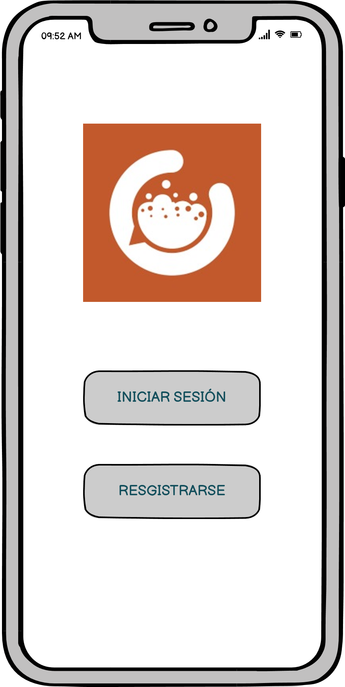
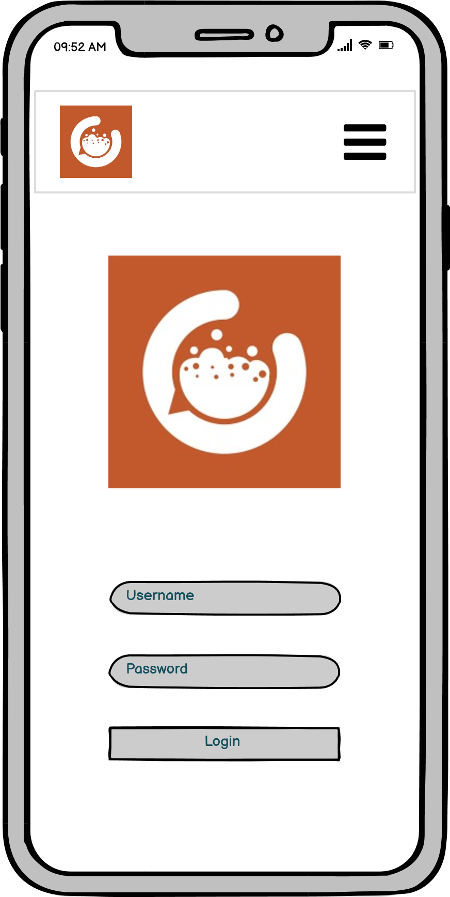
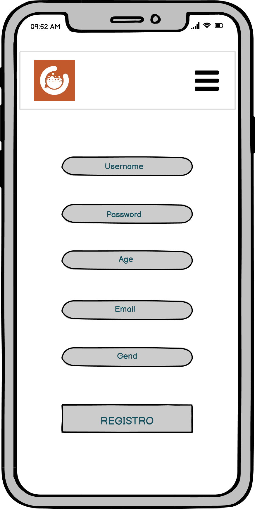
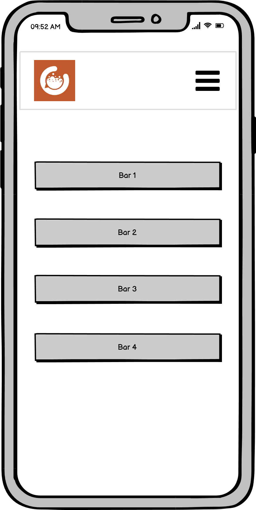
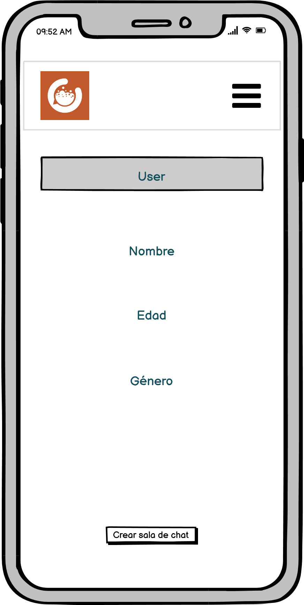
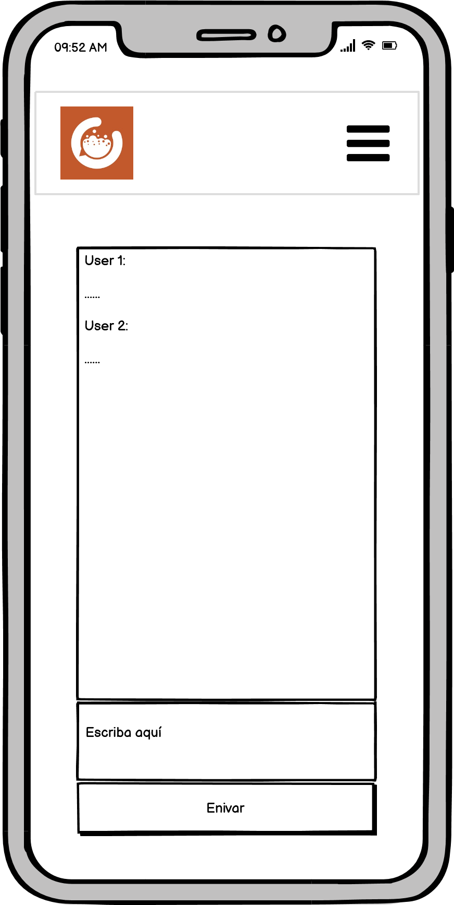

# ChatBar

## Contexto de la app

Con esta app podrás chatear con personas que se encuentren dentro de un mismo bar.
En una época marcada por la pandemia causada por el virus SARS-CoV-2, comúnmente conocido como "covid-19", tras varios meses de confinamientos y restricciones en todo el mundo, cada país poco a poco se dirige a la normalidad previa a esta enfermedad.

En el caso de España, en el sector de la restauración y el ocio nocturno, se deben respetar una serie de restricciones que hacen que nuestra manera de relacionarnos con la gente haya cambiado.
Una de las medidas acordadas por las autoridades sanitarias es la del distanciamiento social, que obliga a las personas asistentes a cualquier bar o pub a ocupar una mesa determinada no pudiendo moverse entre éstas y no pudiendo ser más de cuatro personas en cada una.

La idea de esta app surge a raíz de lo anteriormente expuesto, posibilitando así el la posibilidad de relacionarse con gente de una manera mixta; de manera presencial pero a la vez respetando las medidas sanitarias.

## ¿Qué puede hacerse?

- Crear usuario
- Login
- Ver lista de bares
- Entrar/salir de un bar
- Ver los usuarios del bar
- Crear sala de chat
- Enviar mensaje
- Eliminar chat
- Eliminar mensajes
- Ver mis chats
- Ver mis mensajes

## Diagrama de relaciones entre modelos

## Direccionamiento

Usuario 
> /users

    GET:      /                          → ruta privada que muestra todos los usuarios
    POST:     /signup                    → ruta pública para la creación de nueva cuenta
              /login                     → ruta pública para ingresar en la app
                
Bares
> /bares

    POST:     /                           → ruta privada que crea un nuevo bar a través de las keys: "name" y "city"
    GET:      /                           → ruta privada que muestra lista de bares con las keys: "id", "name", "city" y número de usuarios
              /find/:id                   → ruta privada que busca un bar por su id
    PUT:      /add_user                   → ruta privada que añade un usario a un bar, con la id de ambos
              /remove_user                → ruta privada que elimina un usuario de un bar, con la id de ambos
    DELETE:   /remove_bar                 → ruta privada que elimina un bar por su id

Chat room

> /chat_room

    GET:       /find/:id                  → ruta privada que busca una sala de chat por su id y la id de un usuario que se encuentre en ella
    POST:      /new_room                  → ruta privada que crea una sala de chat con la id de un bar y la id de un usuario que se 
                                            encuentre dentro de éste
    DELETE:    /remove_messages_room      → ruta privada que elimina todos los mensajes de una sala de chat, a través de la id de un 
                                            usuario que se encuentre dentro
Mensajes

> /messages

    PUT         /messages/add_message      → ruta privada que añade un mensaje a una sala de chat, mediante su id y la id del usuario que  
                                             se encuentre dentro de la sala
                                             
    DELETE:     /remove_messages           → ruta privada que elimina un mensaje en concreto a través de su id

## Wireframes

## About

- Current version: V1.0

## Backend

- Basado en Node.JS.
- Base de datos alojada en MongoAtlas. Llamadas a través de Mongoose.
- Encriptamiento de datos (password) y protección de rutas privadas con bcrypt y jsonwebtoken.
- Direccionamiento con Express.

## Dependencias

- bcrypt: "^5.0.1",
- dotenv: "^10.0.0",
- express: "^4.17.1",
- jsonwebtoken: "^8.5.1",
- mongoose: "^5.12.12"

Para el funcionamiento de la app, es necesario instalar las dependencias, usando el comando: **npm install**

## Middleware

- express.json()
- express.urlencoded()
- errorHandler
- checkToken

## Tecnologías usadas

- JavaScript
- Node.JS v14.16.0.
- MongoDB
- React

## ToDo

- Añadir enlace a navbar para ver los chats del usuario
- Mejorar sistema de chat con Socket
- Añadir la posibilidad de cambio de credenciales
- Mejorar el estilo